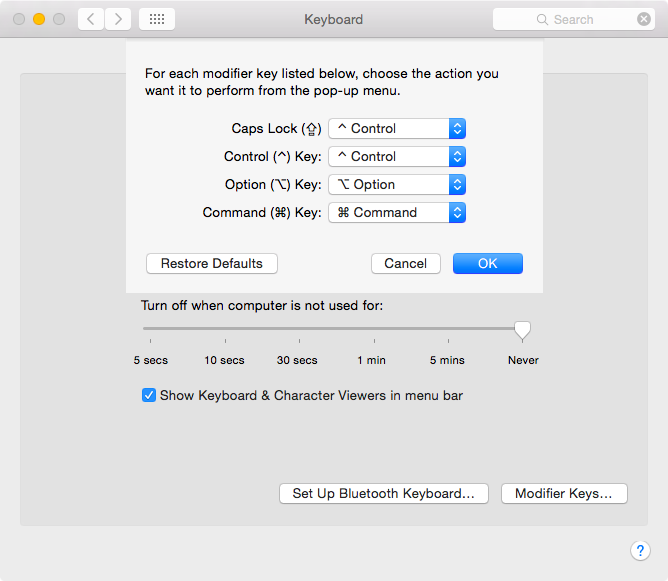
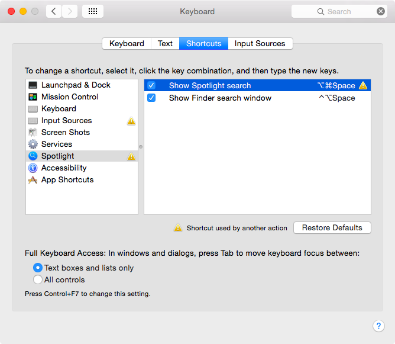
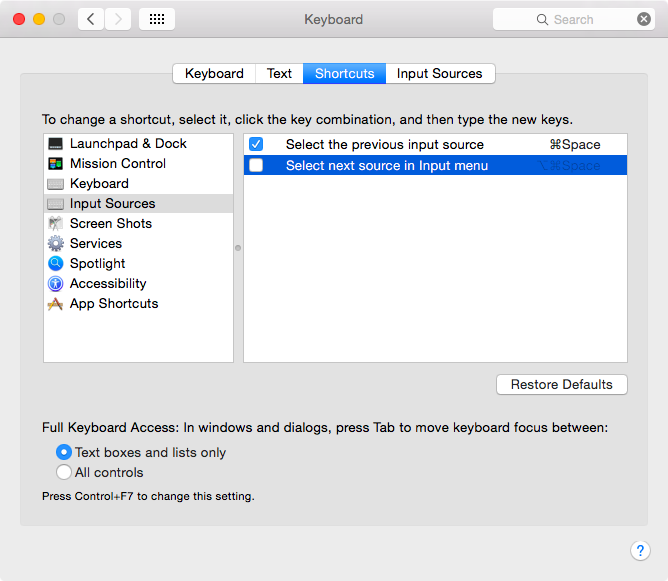

# キーボード設定

Emacsでは{kbd}`Ctrl`キーをよく使います。
デフォルトのキーの場所（だいたい左下）では左手の小指がとても疲れてしまうため、{kbd}`A`の隣にある{kbd}`CapsLock`を置き換えてしまうことをオススメします。
ほとんどのEmacsユーザはそうしていると思います。

キーボード設定も考え始めると沼ですが、誰かのパソコンをちょっと使うときやパソコンを買い替えた時の再設定がめんどくさくなるので、ほどほどにしておいたほうがよいです。

僕の場合は以下の3点を変更しています。

| 変更点 | 変更前 | 変更後 |
|---|---|---
| Controlキーの追加 | {kbd}`CapsLock` | {kbd}`Control` |
| Spotlight検索 | {kbd}`Control + Space` | {kbd}`Option + Command + Space` |
| Select next input source | {kbd}`Option + Command + Space` | {kbd}`OFF` |

## キーボード設定変更時のスクリーンショット

{guilabel}`CapsLock`を{guilabel}`Control`に変更

{guilabel}`Show spotlight search（スポットライト検索）`のショートカットキーを、デフォルトの{kbd}`Control + Space`から{kbd}`Option + Command + Space`に変更。重複するキーがあるため黄色い警告がでている。

{guilabel}`Select next source in input menu` は、これまでも使ったことがなかったので無効にします
