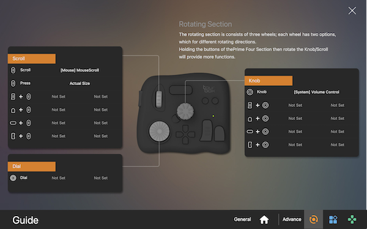

# TourBox Eliteのキー設定

クリエイティブな方々が使っているという左手デバイスを買ってみました。
本来であれば動画編集などで活躍するデバイスですが、普段使いできるようにキー設定を考えてみました。

## デフォルト

アプリに依存しない汎用的なキー設定を考えてみました。
プリセット名は[Default.tb](./Default.tb)としました。

画面のスクロール、音量のコントロール、デスクトップの移動など、よく利用するキーボードショートカットを割り当てています。

### General

### Rotating Section

### Prime Four Section

### Kit Section

## リファレンス

- [TourBox Elite](https://www.tourboxtech.com/jp/TourBoxElite-show.html)
