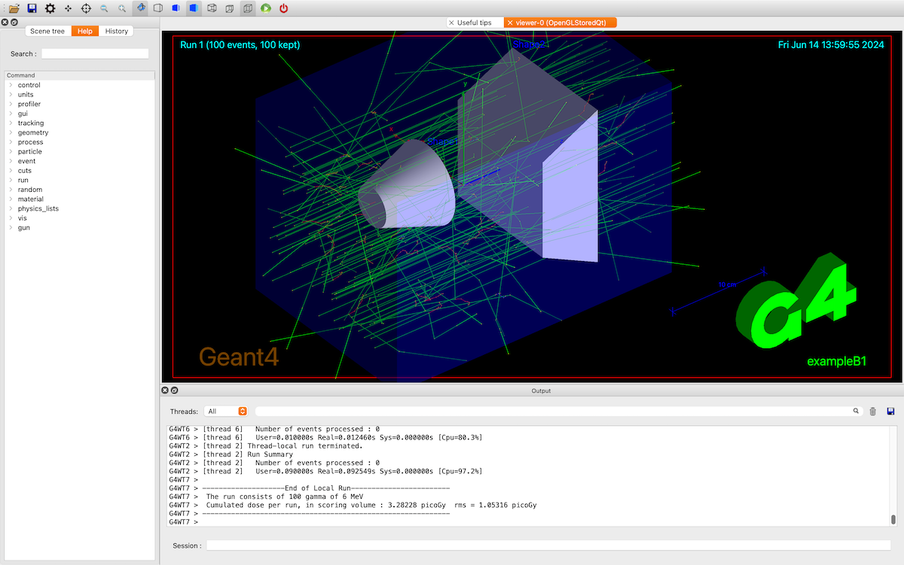

# B1したい（``examples/basic/B1/``）



`basic/B1`は、Geant4アプリケーションの最小構成を示すサンプルです。
簡単な検出器の形状を定義し、一次粒子を入射させ、物質中でのエネルギー損失を記録する、という基本的な流れを確認できます。

まず、`B1`サンプルをビルドして実行し、
マクロファイルを編集して、粒子の種類やエネルギーを変更してみるとよいです。

## ビルドしたい（`cmake`）

```console
$ cd B1
(B1) $ mkdir build
(B1) $ cd build
(B1/build) $ cmake ..
(B1/build) $ make
(B1/build) $ ./exampleB1 run1.mac
(B1/build) $ ./exampleB1 run2.mac
```

`cmake`でビルドし、`exampleB1`という実行ファイルを作成します。
まず、`examples/basic/B1/`の下にビルド用ディレクトリ（`build`）を作成し、その中で``cmake ..`と`make`を実行します。
`./exampleB1`を実行するときにマクロファイル（`run1.mac`など）を指定します。

## メイン（`exampleB1.cc`）

```cpp
//////////////////////////////////////////////////
// exampleB1.cc
//////////////////////////////////////////////////
auto *runManager = G4RunManagerFactory::CreateRunManager(G4RunManagerType::Default)
// Detector construction
runManager->SetUserInitialization(new DetectorConstruction());

// Physics list
G4VModularPhysicsList* physicsList = new QBBC;
physicsList->SetVerboseLevel(1);
runManager->SetUserInitialization(physicsList);

// User action initialization
runManager->SetUserInitialization(new ActionInitialization());

G4UIExecutive *ui = new G4UIExecutive(argc, argv);
G4VisManager *visManager = new G4VisExecutive;
G4UImanager *uiManager = G4UImanager::GetUIpointer();
```

メインプログラムは`exampleB1.cc`です。
ここでは、Geant4アプリケーション全体を制御するための各種マネージャーが生成・設定されています。

まず
`G4RunManagerFactory`によってランマネージャーが作成され、
検出器（`DetectorConstruction`）、
物理リスト、
ユーザーアクション（`ActionInitialization`）
が登録されます。
その後、
`G4UIExecutive`や`G4VisManager`など、
UIや可視化を担当するマネージャーが初期化されます。
これらのマネージャーにより、マクロコマンドの入力や、
イベント・検出器の表示が可能になります。

このように
`exampleB1`では、
シミュレーションを構成する各要素を組み立て、
実行を開始する準備を行なっています。

``console
$ tree B1 -L 2
B1
├── CMakeLists.txt
├── GNUmakefile
├── History
├── README
├── exampleB1.cc
├── include
│   ├── ActionInitialization.hh
│   ├── DetectorConstruction.hh
│   ├── EventAction.hh
│   ├── PrimaryGeneratorAction.hh
│   ├── RunAction.hh
│   └── SteppingAction.hh
├── src
│   ├── ActionInitialization.cc
│   ├── DetectorConstruction.cc
│   ├── EventAction.cc
│   ├── PrimaryGeneratorAction.cc
│   ├── RunAction.cc
│   └── SteppingAction.cc
├── init_vis.mac
├── vis.mac
├── exampleB1.in
├── exampleB1.out
├── run1.mac
├── run2.mac
└── tsg_offscreen.mac
```

B1のディレクトリ構造は上のようになっています。
メインのプログラムは``exampleB1.cc``で、``include/*.hh``と``src/*.cc``に関係するソースコードが格納されています。
``*.mac``は実行ファイルの引数に指定できるマクロファイルです。

``exampleB1.in``もマクロファイルです。
これを読み込んだときの出力が``exampleB1.out``です。


## リファレンス

- [Example B1](https://geant4-userdoc.web.cern.ch/Doxygen/examples_doc/html/ExampleB1.html)
