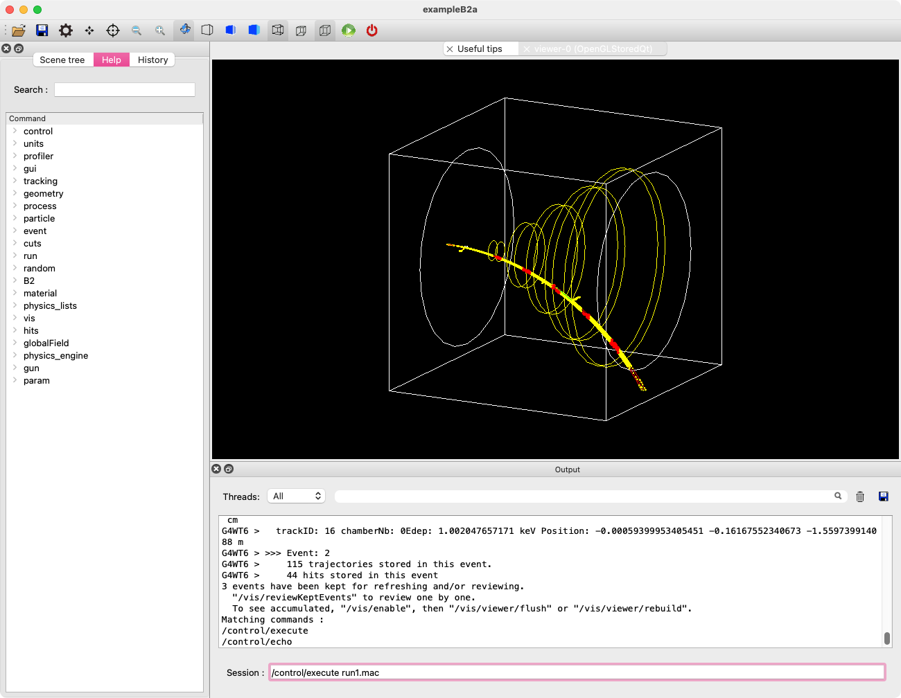

# B2したい（``examples/basic/B2``）



B2の題材は飛跡検出器です。
外部磁場を与え、粒子が曲がる様子を観察できます。

## ビルドしたい（``cmake``）

```console
$ cd examples/basic/B2/B2a
(B2a) $ mkdir build
(B2a) $ cd build
(B2a/build) $ cmake ..
(B2a/build) $ make -j8
(B2a/build) $ ./exampleB2a
```

``examples/basic/B2/``の中には``B2a``と``B2b``のディレクトリがあります。
シミュレーションできることは同じなので、どちらをビルドしてもOKです。
マクロファイルが用意されているので、適当に実行して遊んでみます。

## ``run1.mac``

``run1.mac``では4つの条件で粒子を入射しているようです。

```cfg
# 入射粒子: デフォルト値（種類: 陽子、エネルギー: 3 GeV、方向: (0, 0, 1)）
# 表示レベル: 変更あり
/tracking/verbose 1
/run/beamOn 1
```

```cfg
# 入射粒子: デフォルト値
# 表示レベル: 変更あり
/tracking/verbose 0
/hits/verbose 2
/run/beamOn 1
```

```cfg
# 入射粒子: デフォルト値
# 表示レベル: 変更なし
## /tracking/verbose 0
## /hits/verbose 2
# ターゲットの材料を変更
/B2/det/setTargetMaterial G4_WATER
/B2/det/setChamberMaterial G4_Ar
/run/beamOn 3
```

```cfg
# 入射粒子: 陽子、エネルギー: 0.3GeVに変更
# 表示レベル: 変更なし
## /tracking/verbose 0
## /hits/verbose 2
# 磁場を印加
/globalField/verbose 1
/globalField/setValue 0.2 0 0 tesla
/B2/det/stepMax 1.0 mm
/gun/energy 0.3 GeV
/run/beamOn 3
```

## 測定器はどうなってるの？

- world: 直方体（``G4Box``）、空気（``G4_AIR``）
- target: 円柱（``G4Tubs``）、鉛（``G4_Pb``）
- chamber: 円柱（``G4Tubs``）、Xeガス（``G4_Xe``）

```cpp
for (G4int copy_number=0; copy_number < fNumberOfChambers; copy_number++>){
    G4double z = first_position + copy_number * chamber_spacing;
    G4double rmax = rmax_first + copy_number * rmax_increment;
    auto chamberSolid = new G4Tubs("ChamberSolid", 0, rmax, halfwidth, 0.*deg, 360.*deg);
    fLogicalChamber[copy_number] = G4Tubs(chamberSolid, "Xe", "chamberLogical");
    new G4PVPlacement(
        nullptr,
        G4ThreeVector(0, 0, z),
        "ChamberLogical",
        fLogicalTracker,
        false,
        copy_number,
        fCheckOverlaps);
}
```

``fNumberOfChambers``の数だけforループを回して、トラッカー（飛跡検出器）を設置しています。
``copy_number``をインクリメントして、トラッカーごとに設定しています。


```cfg
# run1.mac
/B2/det/setTargetMaterial G4_WATER
/B2/det/setChamberMaterial G4_Ar
```

マクロで測定器の材質を変更しています。
どうやってるんだろう？

## 相互作用はどうなってるの？

## 外部磁場はどうなってるの？

```cfg
# run1.mac
/globalField/verbose 1
/globalField/setValue 0.2 0 0 tesla
```

マクロで外部磁場の強さを変更しています。
どうやってるんだろう？
