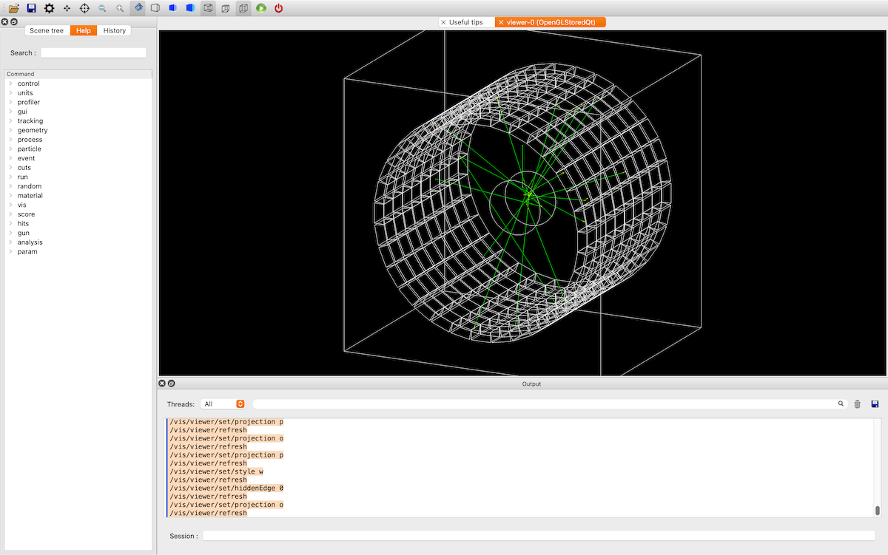

# B3したい（``examples/basic/B3``）



B3の題材はPETです。
患者の頭を円柱とし、その周りをLSO結晶で作ったガンマ線検出器で取り囲んでいます。

## ビルドしたい

```console
$ cd examples/basic/B3/B3a
(B3/B3a/) $ mkdir build
(B3/B3a/) $ cd build
(B3/B3a/build/) $ cmake ..
(B3/B3a/build/) $ make -j8
(B3/B3a/build/) $ ./exampleB3a
```

``examples/basic/B3/``の中には``B3a``と``B3b``のディレクトリがあります。

## 患者の頭部を作成する

```cpp
G4LogicalVolume* DefinePatientVolume(const G4String &aName)
{
    // 脳の組織を取得する
    G4NistManager *nm = new G4NistManager::Instance()
    auto material = nm->FindOrBuildMaterial("G4_BRAIN_ICMP");

    // 円柱を作成する
    // 半径 : 8 cm
    // 長さ : 10cm
    auto solid = new G4Tubs(
        "Patient",
        0.,
        8 * cm,    // 半径
        5 * cm,    // 長さ
        0. * deg,
        360. * deg
    )

    // 論理物体を作成する
    auto logical = new G4LogicalVolume(
        solid,
        material,
        aName,
    )

    return logical;
}
```

```cpp
// 物理物体を配置する
auto logicPatient = DefinePatientVolume("PatientLV");
new G4PVPlacement(
    nullptr,
    G4ThreeVector(),
    logicPatient,
    "Patient",
    logicWorld,
    false,
    0,
    fCheckOverlaps,
)
```

## 放射線源を作成する

```cpp

void PrimaryGneneratorAction::GeneratePrimaries(G4Event *aEvent)
{
    G4int numberOfParticles = 1;
    auto fParticleGun = new G4ParticleGun(numberOfParticles);

    // Fluorine
    G4int Z = 9
    G4int A = 18;
    G4double ionCharge = 0. * eplus;
    G4double exciteEnergy = 0. * keV;

    G4ParticleDefinition* ion = G4IonTable::GetIonTable()->GetIon(Z, A, exciteEnergy);

    fParticleGun->SetParticleDefinition(ion);
    fParticleGun->SetParticleCharge(ionCharge);

    // 入射位置の初期値
    G4double x0 = 4. * cm;
    G4double y0 = 4. * cm;
    G4double z0 = 4. * cm;

    G4double dx0 = 1. * cm;
    G4double dy0 = 1. * cm;
    G4double dz0 = 1. * cm;

    // 入射位置をランダムにする
    x0 += dx0 * (G4UniformRand() - 0.5);
    y0 += dy0 * (G4UniformRand() - 0.5);
    z0 += dz0 * (G4UniformRand() - 0.5);

    auto vertex = G4ThreeVector(x0, y0, z0);
    fParticleGun->SetParticlePosition(vertex);
    fParticleGun->GeneratePrimaryVertex(aEvent);
}

```

## リファレンス

- [Example B3](https://geant4-userdoc.web.cern.ch/Doxygen/examples_doc/html/ExampleB3.html)
