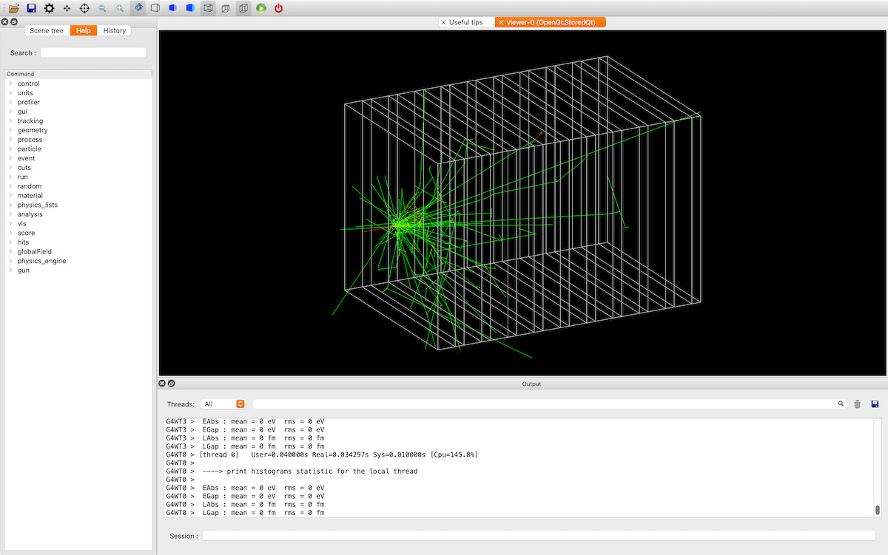

# B4したい（``examples/basic/B4``）



B4の題材は電磁カロリメータです。
液体アルゴンと鉛のサンドイッチ構造になっています。

## ビルドしたい

```console
$ cd examples/basic/B4/B4d
(B4/B4d/) $ mkdir build
(B4/B4d/) $ cd build
(B4/B4d/build/) $ cmake ..
(B4/B4d/build/) $ make -j8
(B4/B4d/build/) $ ./exampleB4d
```

``examples/basic/B4/``の中には``B4a``、``B4b``、``B4c``、``B4d``のディレクトリがあります。
``B4d``は``G4AnalysisManager``を使ってROOTファイルに出力する方法を確認できます。

## リファレンス

- [Example B4](https://geant4-userdoc.web.cern.ch/Doxygen/examples_doc/html/ExampleB4.html)
