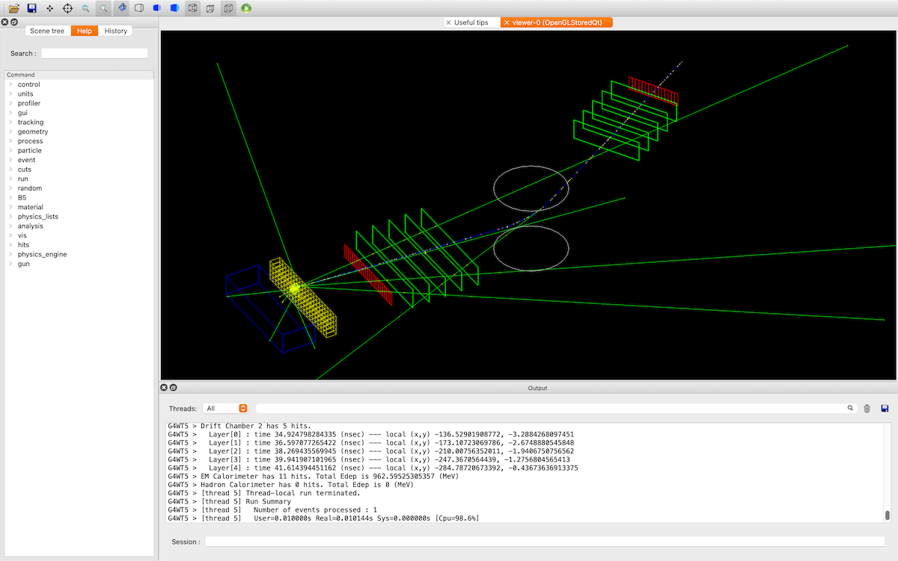

# B5したい（``examples/basic/B5``）



B5の題材は複合的なビームテストです。
2つのビーム軸があり、磁場をかけることがあります。
ビーム軸には、電磁カロリメーター（黄）、ハドロンカロリメーター（青）、ホドスコープ（赤）、トラッカー（緑）が設置されています。

## ビルドしたい

```console
$ cd examples/basic/B5
(B5/) $ mkdir build
(B5/) $ cd build
(B5/build/) $ cmake ..
(B5/build/) $ make -j8
(B5/build/) $ ./exampleB5
```

