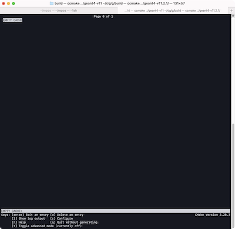
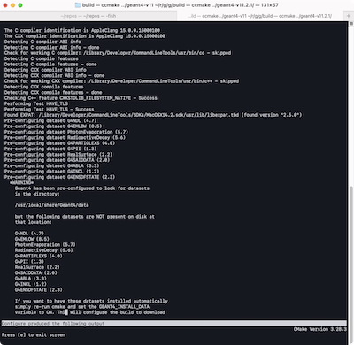

# ビルドを確認する（``ccmake``）

```console
// ビルド用ディレクトリで作業する
// CMakeLists.txtがあるディレクトリを指定する
(~/geant4/build/) $ ccmake ../geant4-v11.2.1/
```

``ccmake``でビルドオプションをターミナル上で視覚的に変更できます。
インストール先となる``CMAKE_INSTALL_PREFIX``の設定が正しいことを確認します。
Qtを使う場合は、``QT_DIR``（と``Qt5``系）のパスが設定されていることを確認してください。

``GEANT4_USE``系の設定フラグは、この画面でトグルして変更できます。
変更を加えた場合は``[c] Configure``を実行し、``CMakeLists.txt``を再生成します。

:::{figure-md}


ビルドオプションの確認（ページ1）
:::

:::{figure-md}


ビルドオプションの確認（ページ2）
:::

## ディレクトリ構成

```console
$ tree ~/geant4/build/ -L 2
~/geant4/build/
├── BuildProducts
├── CMakeCPackOptions.cmake
├── CMakeCache.txt
├── CMakeFiles
├── CPackConfig.cmake
├── CPackSourceConfig.cmake
├── Externals
├── G4EXPATShim.cmake
├── G4FreetypeShim.cmake
├── G4HDF5Shim.cmake
├── G4ModuleAdjacencyList.txt
├── G4ModuleInterfaceMap.csv
├── G4MotifShim.cmake
├── G4X11Shim.cmake
├── Geant4Config.cmake
├── Geant4ConfigVersion.cmake
├── Geant4LibraryDepends.cmake
├── Geant4PackageCache.cmake
├── InstallTreeFiles
├── LICENSE.txt
├── Makefile
├── Modules
├── README.txt
├── UseGeant4.cmake
├── UseGeant4_internal.cmake
├── _source_extras
├── cmake_install.cmake
├── cmake_uninstall.cmake
├── cmake_uninstall.cmake.in
├── cxx_filesystem
├── data
├── geant4-config
├── geant4_module_check.py
├── geant4_validate_sources.cmake
├── geant4make.csh
├── geant4make.sh
├── install_manifest.txt
├── source
└── source_package_extras.cmake

10 directories, 30 files
```

``build``の中にファイルが生成されました。
このようなディレクトリ構成になっていたら、[次のmake](./geant4-install-make.md)に進んでください。
