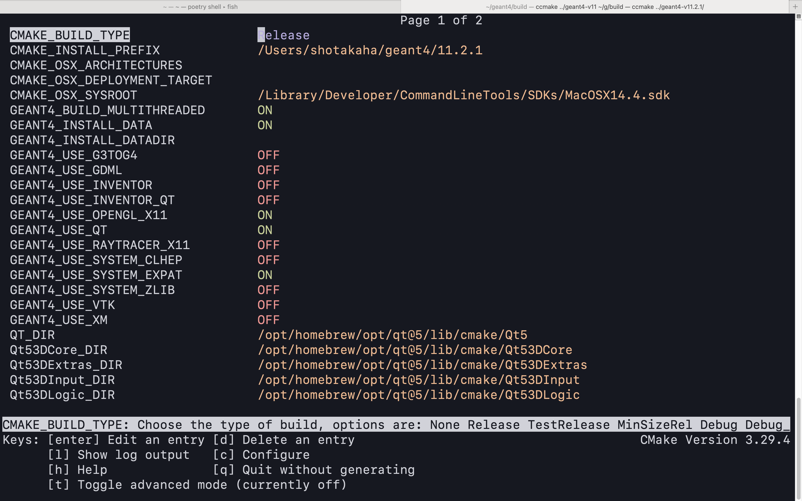
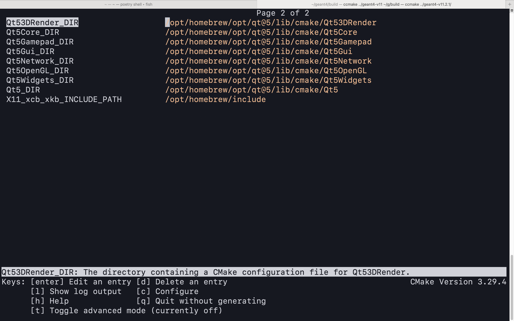

# ビルドを確認する（``ccmake``）

```console
// ビルド用ディレクトリで作業する
// CMakeLists.txtがあるディレクトリを指定する
(~/geant4/build/) $ ccmake ../geant4-v11.2.1/
```

``cmake``を使って、ビルドに必要なファイルを作成します。
ビルド用ディレクトリから``CMakeLists.txt``があるディレクトリに対して``cmake``を実行します。
``ccmake``は``cmake``のGUI版みたいなもので、オプション設定をターミナル上で視覚的に変更できます。

ここでは``ccmake``を使った作業をまとめます。
今回はひとまず以下の項目の設定しました。

| オプション名 | 設定値 | デフォルト値 |
|---|---|---|
| ``CMAKE_INSTALL_PREFIX`` | ``$G4HOME/g4install/install`` | ``/usr/local/`` |
| ``GEANT4_BUILD_MULTITHREADED`` | ``ON`` | ``ON`` |
| ``GEANT4_INSTALL_DATA`` | ``ON`` | ``OFF`` |
| ``GEANT4_INSTALL_DATADIR`` | ``$G4HOME/g4install/data`` | |
| ``GEANT4_USE_OPENGL_X11``  | ``ON`` | ``OFF`` |
| ``GEANT4_USE_QT``  | ``ON`` | ``OFF`` |
| ``GEANT4_USE_RAYTRACER_X11`` | ``ON`` | ``OFF`` |
| ``GEANT4_USE_SYSTEM_EXPAT`` | ``ON`` | ``OFF``|

オプション設定が終わったら、``[g] Generate``を入力し、設定に必要なファイルを自動生成します。

:::{note}

``cmake``には「out-of-source」というコンセプトがあり、
ソースコード本体とビルドしたファイルは別々のディレクトリで管理するしきたりがあるようです。
しきたりにしたがい、ここでの作業はすべて、事前に作成した``build``ディレクトリの中で実行します。

:::

:::{figure-md}


``ccmake``を実行すると``EMPTY CACHE``と表示される。
気にせずに{guilabel}`c`（`[c] Configure`）を入力してください。
:::

:::{figure-md}


``configure``が終わったら{guilabel}`e`（``Press [e] to exit screen``）で画面を抜けてください。
:::

:::{figure-md}


画面を抜けると、オプションが設定できるようになっています。
``vim``風に{guilabel}`j`と{guilabel}`k`でカーソル移動し、{guilabel}``enter``でON/OFFを切り替えたり、パスを編集したりできます。
:::

:::{figure-md}


``GEANT4_USE_QT=ON``にしました。これは失敗します。
:::

:::{figure-md}


``GEANT4_USE_QT=ON``の設定に失敗したエラーです。
``CMAKE_INSTALL_PREFIX``もしくは``QT_DIR``を設定すればよいそうです。
:::

:::{figure-md}


ひとまず``GEANT4_USE_QT=OFF``にして進めます。
:::

:::{figure-md}


``XQuartz``が見つからなくてエラーが表示されました。
一度終了して、``brew install --cask xquartz``してから、再び``ccmake``しました。
:::

:::{figure-md}


``XQuartz``が認識されました。次に進みます。
:::

:::{figure-md}


``QT_DIR``の項目が追加されていました。
``brew --prefix qt@5``のパスに設定しました。
:::

:::{figure-md}


やはり失敗するので、``GEANT4_USE_QT=OFF``にもどします。
``QT_DIR``の設定ではうまくいかないことが確認できたので、
コマンドラインで``CMAKE_INSTALL_PREFIX``を設定することにしました。
:::


```console
$ cmake -DGEANT4_USE_QT=ON -DCMAKE_PREFIX_PATH=$(brew --prefix qt@5) ../geant4-v11.2.1/
-- Checking C++ feature CXXSTDLIB_FILESYSTEM_NATIVE - Success
-- Configuring download of missing dataset G4NDL (4.7)
-- Configuring download of missing dataset G4EMLOW (8.5)
-- Configuring download of missing dataset PhotonEvaporation (5.7)
-- Configuring download of missing dataset RadioactiveDecay (5.6)
-- Configuring download of missing dataset G4PARTICLEXS (4.0)
-- Configuring download of missing dataset G4PII (1.3)
-- Configuring download of missing dataset RealSurface (2.2)
-- Configuring download of missing dataset G4SAIDDATA (2.0)
-- Configuring download of missing dataset G4ABLA (3.3)
-- Configuring download of missing dataset G4INCL (1.2)
-- Configuring download of missing dataset G4ENSDFSTATE (2.3)
-- The following Geant4 features are enabled:
CMAKE_CXX_STANDARD: Compiling against C++ Standard '17'
GEANT4_BUILD_MULTITHREADED: Build multithread enabled libraries
GEANT4_BUILD_TLS_MODEL: Building with TLS model 'initial-exec'
GEANT4_USE_SYSTEM_EXPAT: Using system EXPAT library
GEANT4_USE_OPENGL_X11: Build Geant4 OpenGL driver with X11 support
GEANT4_USE_RAYTRACER_X11: Build RayTracer driver with X11 support
GEANT4_USE_QT: Build Geant4 with Qt5 support
GEANT4_USE_QT3D: Build Geant4 Qt3D driver

-- Configuring done (2.7s)
-- Generating done (0.8s)
-- Build files have been written to: /Users/shotakaha/repos/g4home/g4install/build
```

:::{figure-md}


``cmake``したあと、再び``ccmake``して設定を確認しました。
Qt関係のファイルも認識されていることを確認しました。

:::

## ディレクトリ構成

```console
$ tree g4home -L 3
g4home
└── g4install
    ├── build
    │   ├── BuildProducts
    │   ├── CMakeCPackOptions.cmake
    │   ├── CMakeCache.txt
    │   ├── CMakeFiles
    │   ├── CPackConfig.cmake
    │   ├── CPackSourceConfig.cmake
    │   ├── Externals
    │   ├── G4EXPATShim.cmake
    │   ├── G4FreetypeShim.cmake
    │   ├── G4HDF5Shim.cmake
    │   ├── G4ModuleAdjacencyList.txt
    │   ├── G4ModuleInterfaceMap.csv
    │   ├── G4MotifShim.cmake
    │   ├── G4X11Shim.cmake
    │   ├── Geant4Config.cmake
    │   ├── Geant4ConfigVersion.cmake
    │   ├── Geant4LibraryDepends.cmake
    │   ├── Geant4PackageCache.cmake
    │   ├── InstallTreeFiles
    │   ├── LICENSE.txt
    │   ├── Makefile
    │   ├── Modules
    │   ├── README.txt
    │   ├── UseGeant4.cmake
    │   ├── UseGeant4_internal.cmake
    │   ├── _source_extras
    │   ├── cmake_install.cmake
    │   ├── cmake_uninstall.cmake
    │   ├── cmake_uninstall.cmake.in
    │   ├── cxx_filesystem
    │   ├── data
    │   ├── geant4-config
    │   ├── geant4_module_check.py
    │   ├── geant4_validate_sources.cmake
    │   ├── geant4make.csh
    │   ├── geant4make.sh
    │   ├── source
    │   └── source_package_extras.cmake
    ├── data
    ├── geant4-v11.2.1
    │   ├── CHANGELOG -> ReleaseNotes
    │   ├── CITATION.cff
    │   ├── CMakeLists.txt
    │   ├── CONTRIBUTING.rst
    │   ├── LICENSE
    │   ├── README.rst
    │   ├── ReleaseNotes
    │   ├── cmake
    │   ├── config
    │   ├── environments
    │   ├── examples
    │   ├── packaging
    │   └── source
    ├── geant4-v11.2.1.zip
    └── install

23 directories, 35 files
```

``build``の中にファイルが生成されました。
ここでうまく設定できていないようであれば、[次のcmake](./geant4-install-cmake.md)に進んでください。
このようなディレクトリ構成になっていたら、[次の次のmake](./geant4-install-make.md)に進んでください。
