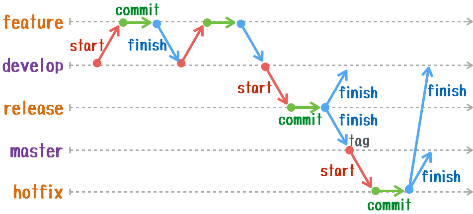

# Git Flow の使い方

``git flow`` は
[Vincent Driessenのブランチモデル](https://nvie.com/posts/a-successful-git-branching-model/)
に基づいたGit拡張です。

**ブランチの用途（開発なのか、リリースなのか、ホットフィックスなのか）** に焦点をあて、
それに合ったブランチ切り替えが簡単にできるように、何種類かのGitコマンドをまとめたものです。
実際に ``git-flow`` コマンドの中身はシェルスクリプトです。

下の図は ``git-flow`` を整理するために自分で作ってみた図です。
上のリンク先にある図と内容は同じだけど、ちょっと見た目をシンプルにしてみました。

たとえば ``git flow start MyFeature`` の場合、

1. ``develop`` ブランチをチェックアウトする（ ``$ git checkout develop``）
1. ``develop`` ブランチから feature ブランチを作成する（ ``$ git branch feature/MyFeature``）
1. その``feature``ブランチをチェックアウトする（ ``$ git checkout feature/MyFeature``）

といったように、3手間かかるのが1手間で済みます。

``git flow release finish MyRelease`` の場合の部分を眺めてみると分かるかもですが、
ブランチ管理がとても楽になるので、オススメです。

