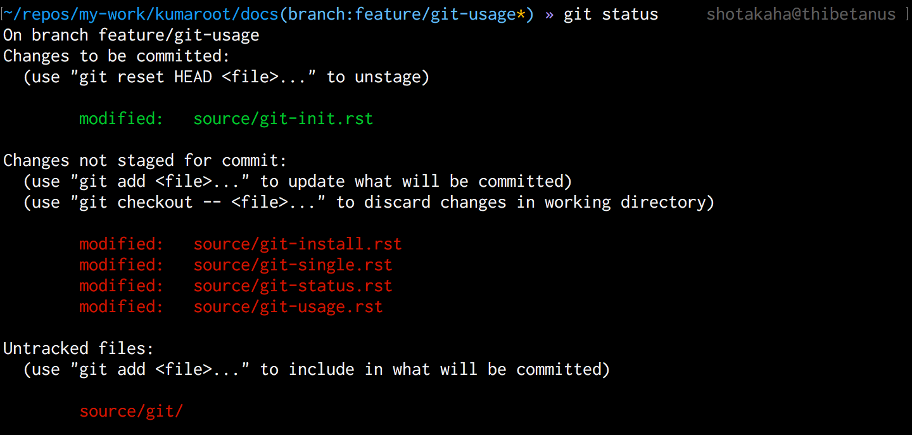

# 状態の確認（``git status``）

```bash
$ git status
```

リポジトリの状態を確認するためのコマンドです。
おそらく、もっとも頻繁に使うことになるコマンドです。

このコマンドを実行すると、

* いまどのブランチにいるのか ``On branch BRANCH``
* どのファイルがステージされているのか ``Changes to be committed:``
* どのファイルがステージされてないのか ``Changes not staged for commit:``
* どのファイルがGit管理されていないのか ``Untracked files``

などを把握することができます。

また、各ファイルに対する次の操作コマンドを教えてくれるので、
だいたいのことはマニュアルを読むことなく操作できます。



