# インストールしたい

Raspberry Piのインストール手順は[公式サイト](https://www.raspberrypi.com/documentation/computers/getting-started.html#install-using-imager)に詳しく載っているので、まず、そちらを参照するとよいです。

## 事前準備

- Raspberry Pi 本体 + 周辺機器
- マイクロSDカード（32GB / FAT）
- Raspberry Pi Imager

公式の[Raspberry Pi Imager](https://www.raspberrypi.com/software/)を使って、
マイクロSDカードをフォーマットしたり、OSイメージを書き込みんだりします。

Homebrewを使ってインストールできます。

```console
$ brew install --cask raspberry-pi-imager
```

## マイクロSDカードを用意する

OSイメージを書き込むマイクロSDカードを用意します。
32GBより大きなカードは``exFAT``形式になっているので、
``FAT32``形式に再フォーマットします。

### Raspberry Pi Imagerを起動する

Raspberry Pi Imagerを起動します。
2024/01/26時点の最新版はv1.8.5です。

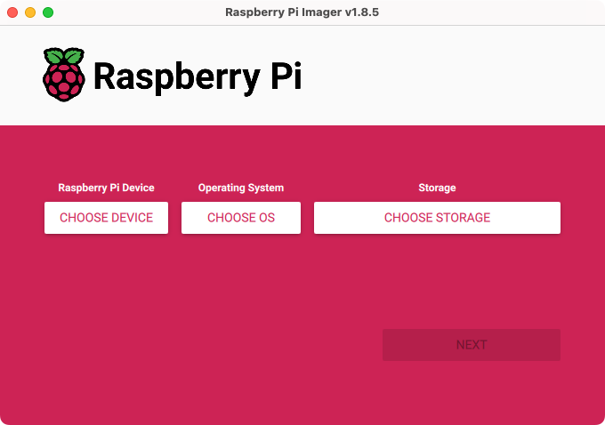

### FAT32でフォーマットする

 {guilabel}`Operating System` → {guilabel}`Erase` を選択して、
 カードをフォーマットします。

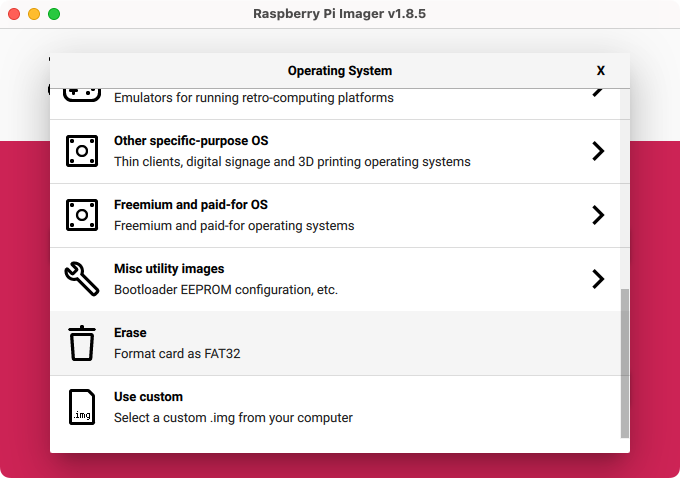

### 警告ダイアログを了承する

カードの内容がすべて削除されるという警告ダイアログが表示されます。
カードの取り違えがないか確認して、了承します。
再フォーマットはあっというまに完了します。

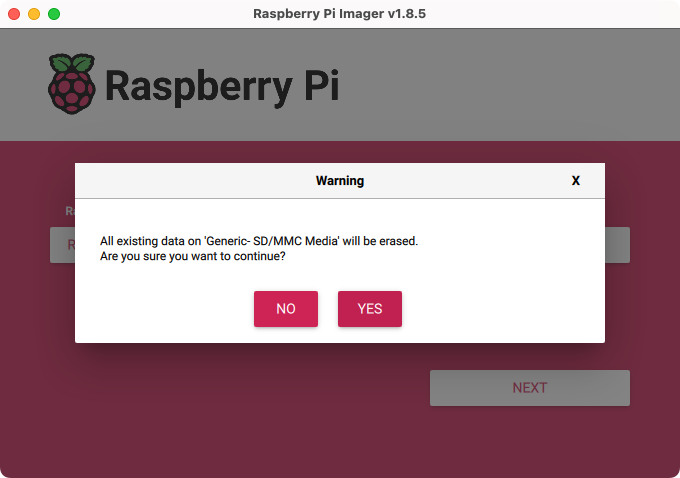

## OSを準備する

Raspberry Piで使用するOSイメージをマイクロSDカードに書き込みます。

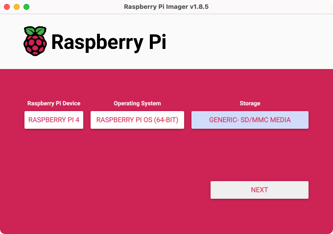

### デバイスを選択する

使用するRaspberry Pi本体のバージョンを選択します。

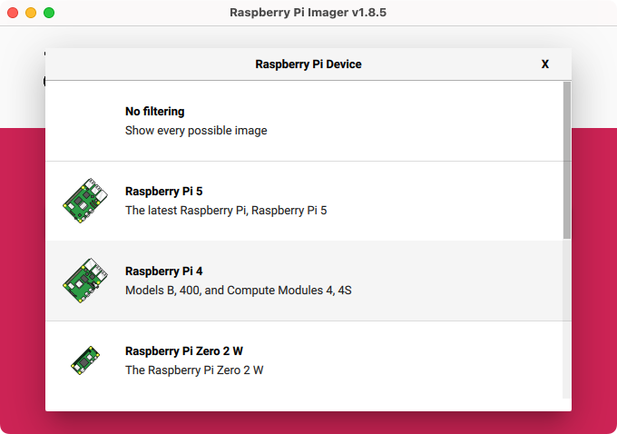

### OSを選択する

インストールするOSイメージを選択します。
推奨されているとおり``Raspberry Pi OS (64-bit)``を選択すればOKです。
UbuntuやRISC-V OSなどのイメージも選択できます。

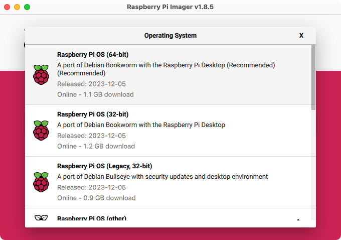

### カードを選択する

イメージを書きこむカードを選択します。

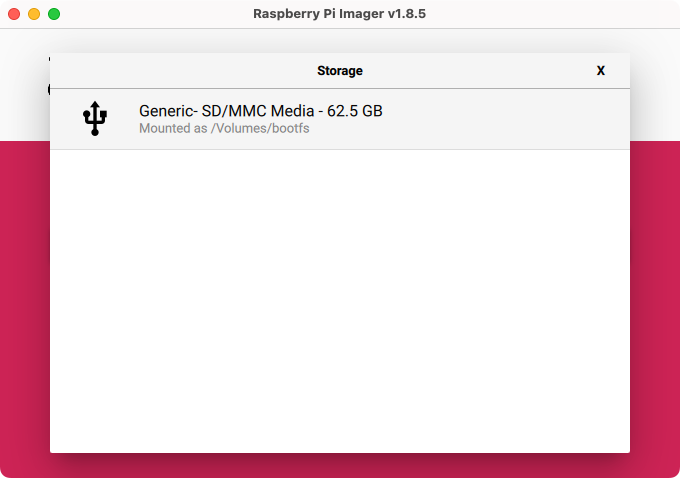

## イメージをカスタマイズする

イメージを書き込む前に、カスタマイズできます。
ホスト名／ユーザー名を設定し、SSH設定を有効にしておくと、すぐにリモート接続できるようになります。

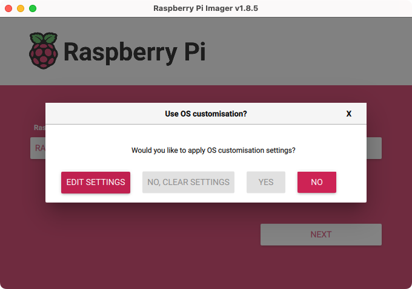

### ホスト名／ユーザー名を設定する

ホスト名と、ユーザー名／パスワードを設定します。
ついでに、タイムゾーンとキーボードレイアウトも設定しておきました。
利用するWi-Fiが決まっている場合、あらかじめ設定しておくことができます。

:::{caution}

従来のデフォルトでは``pi@raspberrypi``でしたが、
現在は、セキュリティ対策の観点から公式に**非推奨**です。
禁止はされていませんが、できるかぎり別のホスト名／ユーザー名を使うようにしましょう。

:::


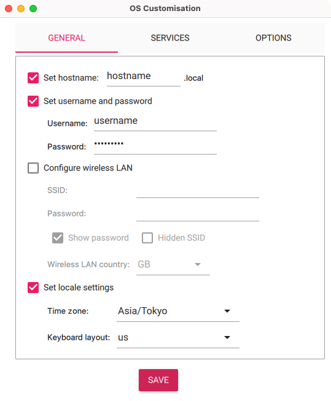

### SSHを設定する

SSH接続をデフォルトで有効にします。
ユーザー名とパスワードを使った認証でOKです。
（公開鍵を使った認証はあとから設定できるはずです）

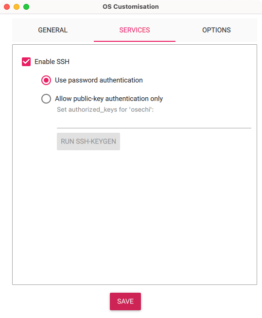

### オプションを設定する

書き込みが終わったあとの設定をします。
すべてにチェックを入れておけばよいです。

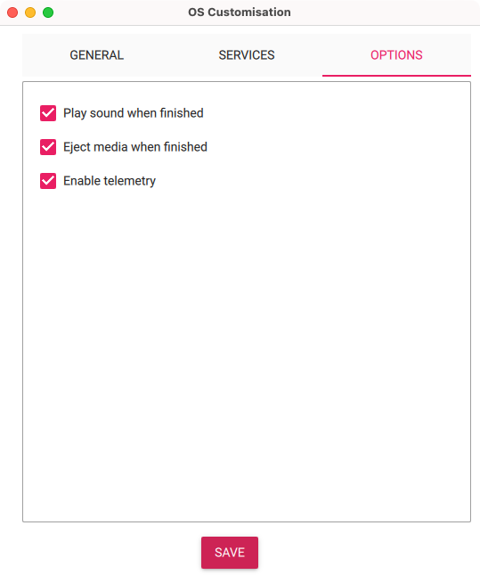
