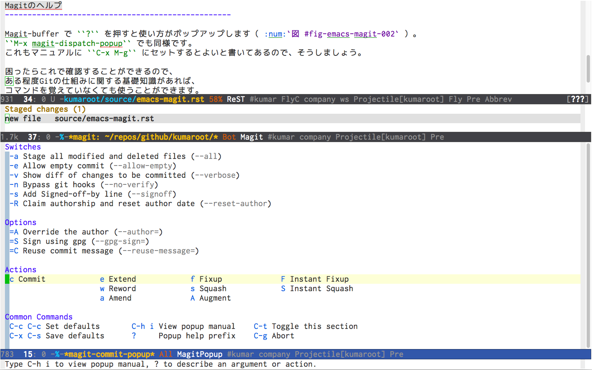
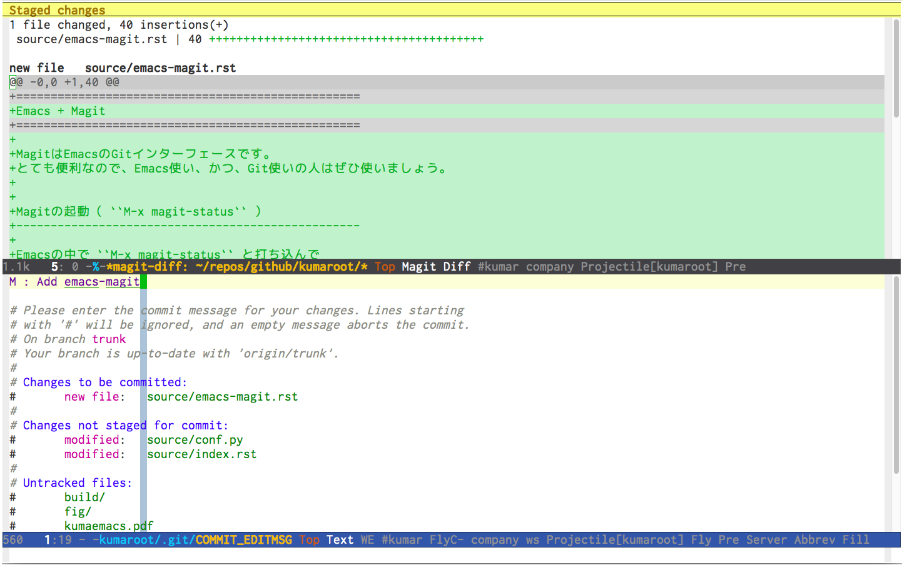

==================================================
Emacs + Magit
==================================================

MagitはEmacsのGitインターフェースです。
とても便利なので、Emacs使い、かつ、Git使いの人はぜひ使いましょう。

Magitの起動（ ``M-x magit-status`` ）
--------------------------------------------------

Emacsの中で ``M-x magit-status`` と打ち込んで
``magit-bufer`` を起動します（ :num:`図 #fig-magit-status` ）。

Magitはこのバッファを通じて操作をすることになるので、
キーバインド設定をしておきましょう。
マニュアルを読むと ``C-x g`` になってるのでそうしましょう。

.. _fig-magit-status:

.. figure:: ./emacs-magit/magit-status.png

   Magit-buffer

Magitのヘルプ
--------------------------------------------------

Magit-buffer で ``?`` を押すと使い方がポップアップします（ :num:`図 #magit-popup` ）。
``M-x magit-dispatch-popup`` でも同様です。
これもマニュアルに ``C-x M-g`` にセットするとよいと書いてあるので、そうしましょう。

困ったらこれで確認することができるので、
ある程度Gitの仕組みに関する基礎知識があれば、
コマンドを覚えていなくても使うことができます。
また、Magitを使っているうちにGitも使えるようになる。

.. _fig-magit-popup:

.. figure:: ./emacs-magit/magit-popup.png

ステージ
--------------------------------------------------

``Untracked files`` の ``source/emacs-magit.rst`` に
カーソルを当て ``s`` を押してファイルをステージします（ :num:`図 #fig-magit-stage` ）。
ステージされたファイルは ``Staged changes`` に移動します。

.. _fig-magit-stage:

.. figure:: ./emacs-magit/magit-stage.png

コミット（ ``C-x g c c``）
--------------------------------------------------

``Staged changes`` にあるファイルはコミットすることができます。
``c`` を押すとコミット用バッファ（ ``magit-commit-popup`` ）がポップアップします（ :num:`図 #fig_magit-commit-popup` ）。
ポップアップ内にある ``Swithes`` 、 ``Options`` 、 ``Actions`` から操作を選択し、頭に付いている記号を入力します。
通常のコミットの場合は ``c`` を押します。

.. _fig-magit-commit-popup:

すると、画面が上下２分割されて ``magit-diff`` バッファ（画面上）と
``.git/COMMIT_EDITMSG`` （画面下）が表示されます（ :num:`図 #fig-magit-commit-edit` ）。
``magit-diff`` には変更した箇所が表示されているので、それを確認しながら、
``.git/COMMIT_EDITMSG`` にコミットメッセージを書きます。
コミットメッセージの編集が終わったら ``C-c C-c`` で保存します。
コミットをやめる場合は ``C-c C-k`` で破棄できます。

.. _fig-magit-commit-edit:

コミットが終わると ``Unpushed commits`` にコミットメッセージが表示されます（ :num:`図 #fig-magit-commit-done` ）。

.. _fig-magit-commit-done:

.. figure:: ./emacs-magit/magit-commit-done.png
