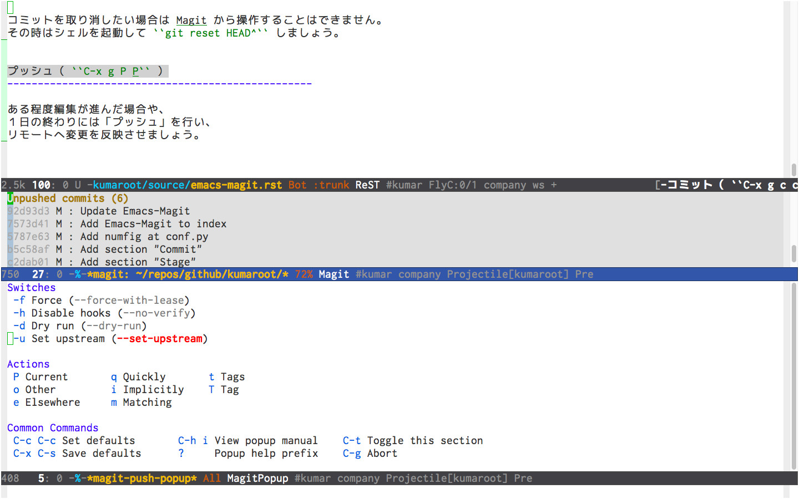

Emacs + Magitの使い方
==================================================

MagitはEmacsのGitインターフェースです。
とても便利なので、Emacs使い、かつ、Git使いの人はぜひ使いましょう。

Magitの起動（ ``M-x magit-status`` ）
--------------------------------------------------

Emacsの中で ``M-x magit-status`` と打ち込んで
Magit用バッファ（ ``magit-bufer`` ）を起動します（ :numref:`fig-magit-status` ）。

Magitはこのバッファを通じて操作をすることになるので、
キーバインド設定をしておきましょう。
マニュアルを読むと ``C-x g`` になってるのでそうしましょう。

.. _fig-magit-status:

.. figure:: ./emacs-magit/magit-status.png
   :align: center

   Magit用バッファ（ :kbd:`M-x magit-status` ）

Magitのヘルプ
--------------------------------------------------

Magit-buffer で :kbd:`?` を押すと使い方がポップアップします（ :numref:`fig-magit-dispatch-popup` ）。
:kbd:`M-x magit-dispatch-popup` でも同様です。
これもマニュアルに :kbd:`C-x M-g` にセットするとよいと書いてあるので、そうしましょう。

困ったらこれで確認することができるので、
ある程度Gitの仕組みに関する基礎知識があれば、
コマンドを覚えていなくても使うことができます。
また、Magitを使っているうちにGitも使えるようになる。

.. _fig-magit-dispatch-popup:

.. figure:: ./emacs-magit/magit-dispatch-popup.png
   :align: center

   Magit用ヘルプ（ :kbd:`M-x magit-dispatch-popup` ）

ステージ／アンステージ
--------------------------------------------------

``Untracked files`` の :file:`source/emacs-magit.rst` に
カーソルを当て :kbd:`s` を押してファイルをステージします（ :numref:`fig-magit-stage` ）。
ステージされたファイルは ``Staged changes`` に移動します。

ファイルを間違えてステージしてしまったなど
アンステージしたい場合は、そのファイルの先頭で :kbd:`u` を押します。

.. _fig-magit-stage:

.. figure:: ./emacs-magit/magit-stage.png
   :align: center

   ファイルのステージ

コミット（ :kbd:`C-x g c c` ）
--------------------------------------------------

``Staged changes`` にあるファイルはコミットすることができます。
:kbd:`c` を押すとコミット用バッファ（ ``magit-commit-popup`` ）がポップアップします（ :numref:`fig-magit-commit-popup` ）。
ポップアップ内にある ``Swithes`` 、 ``Options`` 、 ``Actions`` から操作を選択し、頭に付いている記号を入力します。
通常のコミットの場合は :kbd:`c` を押します。

.. _fig-magit-commit-popup:

.. figure:: ./emacs-magit/magit-commit-popup.png
   :align: center

   コミット用バッファ

すると、画面が上下２分割されて ``magit-diff`` バッファ（画面上）と
``.git/COMMIT_EDITMSG`` （画面下）が表示されます（ :numref:`fig-magit-commit-edit` ）。
``magit-diff`` には変更した箇所が表示されているので、それを確認しながら、
``.git/COMMIT_EDITMSG`` にコミットメッセージを書きます。
コミットメッセージの編集が終わったら :kbd:`C-c C-c` で保存します。
コミットをやめる場合は :kbd:`C-c C-k` で破棄できます。

.. _fig-magit-commit-edit:

.. figure:: ./emacs-magit/magit-commit-edit.png
   :align: center

   コミットメッセージの編集

コミットが終わると ``Unpushed commits`` に
コミットメッセージが表示されます（ :numref:`fig-magit-commit-done` ）。

.. _fig-magit-commit-done:

.. figure:: ./emacs-magit/magit-commit-done.png
   :align: center

   magit-commit-done

コミットを取り消したい場合は :kbd:`C-x g U HEAD^` とすればよいはずです（やったことない）。
もしくはシェルを起動して :command:`git reset HEAD^` しましょう（やったことある）。

プッシュ（ :kbd:`C-x g P P` ）
--------------------------------------------------

ある程度編集が進んだ場合や、１日の終わりには「プッシュ」を行い、
リモートへ変更を反映させましょう。

プッシュをするには ``magit-buffer`` で :kbd:`P` を押して
``magit-push`` バッファを呼び出します（ :numref:`fig-magit-push` ）。
そこで :kbd:`P` を押すとプッシュできます。

ただし、プッシュするブランチがローカルで作ったもので、
リモート先のブランチとの紐付けができていない場合、プッシュは失敗します。
そんな時は :kbd:`-u P` （ ``--set-upstream`` ）すれば大丈夫です。

.. _fig-magit-push:

ちゃんとプッシュできているか確認したい場合は :kbd:`$` を押します。
すると ``magit-process`` バッファが起動します（ :numref:`fig-magit-process` ）。
プロセスが成功していれば最後のコマンドの行頭のステータスが ``0``、
失敗していればエラーコードが赤色で表示されます。
プロセスの詳細は ``TAB`` もしくは ``C-i`` で展開することができます。

.. _fig-magit-process:

.. figure:: ./emacs-magit/magit-process.png
   :align: center

   Gitプロセスの表示

残りの操作
--------------------------------------------------

.. todo:: branch

.. todo:: log

.. todo:: fetch / pull

.. todo:: rebase / merge

.. todo:: show refs

.. todo:: stash

.. todo:: tag
