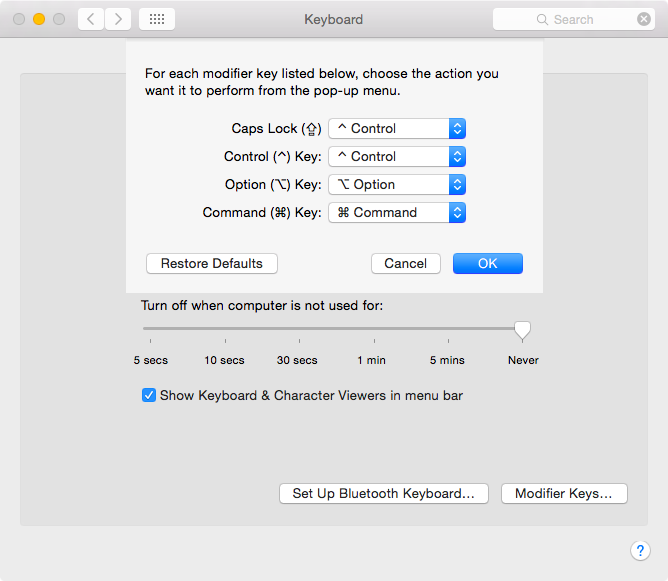
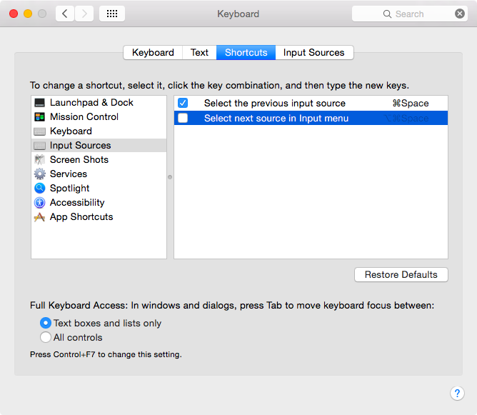

==================================================
Emacsの使い方
==================================================

エディタはプログラミングを楽にするための道具です。
自分に合ったものを選ぶのが一番です。
その参考になるように、Emacsの簡単な使い方と、
便利なパッケージなどを紹介しておこうと思います。

Emacsの学習コスト
==================================================

はじめに学習コストに関して思うところを書いてみます。

Emacsを快適に操作をするためにある程度キーバインドを覚えないといけなかったり、
カスタマイズしようと思うとElispの知識が必要だったり、
と学習コストは高め（決して安くはない）です。

プログラミングの統合開発環境には ``Eclipse`` や ``Xcode`` 、
文書作成には ``Word`` だったり、
TeXの統合環境には ``EasyTeX`` や ``TeXShop`` などがあります。
これらはそれぞれの用途に特化していて、便利になるように設計されているのですが、
結局、各ソフト毎の操作を覚えなくてはいけないため、
実は学習コストは同じくらいなんじゃないかなとも思います。

インストール
==================================================

MacOS Xにインストールする場合、
`Emacs For MacOSX <http://emacsformacosx.com>`__
から既にビルドされたものを取ってくるのが一番です。

基本操作
==================================================

操作方法を羅列するのは無意味なので、
よく使う操作について ``Emacs`` 、``vim`` 、そして ``less`` を比較してみました。

ページ移動
--------------------------------------------------

.. list-table:: ページ移動
   :header-rows: 1
   :stub-columns: 1

   * - 操作内容
     - Emacs
     - Vim
     - less
   * - 次の行へ移動
     - :kbd:`C-n`
     - :kbd:`j` , :kbd:`RET`
     - :kbd:`j` , :kbd:`RET`
   * - 前の行へ移動
     - :kbd:`C-p`
     - :kbd:`k`
     - :kbd:`k`
   * - １ページ進む
     - :kbd:`C-v`
     - :kbd:`C-f`
     - :kbd:`SPC`
   * - １ページ戻る
     - :kbd:`M-v`
     - :kbd:`C-b`
     - :kbd:`S-SPC`
   * - ファイルの先頭へ移動
     - :kbd:`M-<`
     - :kbd:`gg`
     - :kbd:`g`
   * - ファイルの最後へ移動
     - :kbd:`M->`
     - :kbd:`G`
     - :kbd:`G`
   * - 指定した行へジャンプ
     - :kbd:`M-g g 数値`
     - :kbd:`数値 G`
     - :kbd:`:数値`
   * - 半ページ進む
     -
     -
     - :kbd:`d`
   * - 半ページ戻る
     -
     -
     - :kbd:`u`
   * - ファイルを閉じる
     - :kbd:`C-x C-c`
     - :kbd:`:q` ,  :kbd:`:q!`
     - :kbd:`q`

カーソル移動
--------------------------------------------------

.. list-table:: カーソル移動
   :header-rows: 1
   :stub-columns: 1

   * - 操作内容
     - Emacs
     - Vim
   * - 次の文字へ移動
     - :kbd:`C-f`
     - :kbd:`l` , :kbd:`SPC`
   * - 前の文字へ移動
     - :kbd:`C-b`
     - :kbd:`h`
   * - 次の単語へ移動
     - :kbd:`M-f`
     - :kbd:`w` , :kbd:`e`
   * - 前の単語へ移動
     - :kbd:`M-b`
     - :kbd:`b`
   * - 行頭へ移動
     - :kbd:`C-a`
     - :kbd:`0`
   * - 文頭（行頭にある文字）へ移動
     -
     - :kbd:`^`
   * - 行末へ移動
     - :kbd:`C-e`
     - :kbd:`$`
   * - タブ（インデント？）
     - :kbd:`C-i`
     -
   * - 画面内の移動（上−中−下）
     - :kbd:`C-l`
     -

-  Emacsの場合、
   `jawordパッケージ <https://github.com/zk-phi/jaword>`__
   を導入すると日本語の単語移動が賢くなります。

切り貼り
--------------------------------------------------

.. list-table:: 切り貼り
   :header-rows: 1
   :stub-columns: 1

   * - 操作内容
     - Emacs
     - Vim
   * - カーソルの位置から行末までを切り取り
     - :kbd:`C-k`
     - :kbd:`d$`
   * - 選択範囲を切り取り
     - :kbd:`C-w`
     - :kbd:`dd` , :kbd:`d$` , :kbd:`dw` , :kbd:`d^` , :kbd:`d0`
   * - 選択範囲をコピー（yank）
     - :kbd:`M-w`
     - :kbd:`y` , :kbd:`yy` , :kbd:`yw` , :kbd:`y$` , :kbd:`y^` , :kbd:`y0`
   * - 貼り付け
     - :kbd:`C-y`
     - :kbd:`p`

検索
--------------------------------------------------

.. list-table:: 検索
   :header-rows: 1
   :stub-columns: 1

   * - 操作内容
     - Emacs
     - Vim
   * - 前方検索
     - :kbd:`C-s`
     - :kbd:`/文字` , :kbd:`n` , :kbd:`C-i`
   * - 後方検索
     - :kbd:`C-r`
     - :kbd:`?文字` , :kbd:`N` , :kbd:`C-o`
   * - マーカーのセット
     - :kbd:`C-@`
     - :kbd:`v`
   * - 現在行の最初の文字を置換（old -> new）
     - :kbd:`M-%`
     - :kbd:`:s/old/new`
   * - 現在行のすべての文字を置換（old -> new）
     -
     - :kbd:`:s/old/new/g`
   * - ファイル全体のすべての文字を、確認しながら置換
     -
     - :kbd:`:%s/old/new/gc`

-  Emacsの場合、
   `cmigemo <https://github.com/koron/cmigemo>`__ と
   `migemoパッケージ <https://github.com/emacs-jp/migemo>`__
   を導入するとローマ字で日本語検索が可能になります。
-  インストールと設定の詳細は
   `るびきち「日刊Emacs」 <http://rubikitch.com/2014/08/20/migemo/>`__
   を参考にするとよいと思います。

ファイル操作
--------------------------------------------------

.. list-table:: ファイル操作
   :header-rows: 1
   :stub-columns: 1

   * - 操作内容
     - Emacs
     - Vim
   * - ファイルを保存
     - :kbd:`C-x C-s`
     - :kbd:`:w`
   * - ファイル名を指定して保存
     - :kbd:`C-x C-w ファイル名`
     - :kbd:`:w ファイル名`
   * - ファイル名の中身を挿入
     - :kbd:`C-x C-i ファイル名`
     - :kbd:`:r ファイル名`
   * - カーソルの下の文字を削除（Delete）
     - :kbd:`C-d`
     - :kbd:`x`
   * - カーソルの左の文字を削除（Backspace）
     - :kbd:`C-h`
     - :kbd:`Backspace`

-  デフォルトだと :kbd:`C-h` はヘルプですが、
   :kbd:`Backspace` に置き換えています。

エディタ特有
--------------------------------------------------

.. list-table:: エディタ特有
   :header-rows: 1
   :stub-columns: 1

   * - 操作内容
     - Emacs
     - Vim
   * - 改行
     - :kbd:`C-j` , :kbd:`C-o` , :kbd:`C-m` , :kbd:`RET`
     -
   * - 直前の動作の取り消し
     - :kbd:`C-x u` , :kbd:`C-/`
     - :kbd:`u`
   * - 行全体の変更の取り消し
     -
     - :kbd:`U`
   * - 取り消しの取り消し
     -
     - :kbd:`C-r`
   * - ノーマルモードへ切替
     -
     - :kbd:`ESC`
   * - カーソルの位置に文字を追加
     -
     - :kbd:`i`
   * - カーソルの次の位置に文字を追加
     -
     - :kbd:`a`
   * - 行末に文字を追加
     -
     - :kbd:`A`
   * - 行頭に文字を追加
     -
     - :kbd:`I`
   * - カーソルの下の行に文字を追加
     -
     - :kbd:`o`
   * - カーソルの上の行に文字を追加
     -
     - :kbd:`O`
   * - カーソル下の１文字の置換
     -
     - :kbd:`r`
   * - カーソル下の複数文字の置換
     -
     - :kbd:`R`
   * - カーソル位置の単語の変更（削除＋挿入）
     -
     - :kbd:`cw`
   * - カーソル位置から行末までの変更（削除＋挿入
     -
     - :kbd:`c$`
   * - カーソル位置から行頭までの変更（削除＋挿入）
     -
     - :kbd:`c0`
   * - カーソル位置から文頭までの変更（削除＋挿入）
     -
     - :kbd:`c^`
   * - ファイル内の位置の表示
     -
     - :kbd:`C-g`
   * - 対応するカッコへ移動
     -
     - :kbd:`%`
   * - 外部コマンドを実行
     -
     - :kbd:`!コマンド`

キーボード設定
--------------------------------------------------

Emacsを快適に操作するためには、少しだけキーボード設定をした方が良いと思います。
あんまり変えすぎちゃうと、他のPCを使うときやPCを買い替えた時の
再設定がめんどくさくなるので、ほどほどに。

私の場合は以下の３点を変更しています。

.. list-table:: キーボード設定
   :header-rows: 1
   :stub-columns: 1

   * - 変更点
     - 変更前
     - 変更後
   * - Controlキーの追加
     - :kbd:`CapsLock`
     - :kbd:`Control`
   * - Spotlight検索
     - :kbd:`Control + Space`
     - :kbd:`Option + Command + Space`
   * - Select next input source
     - :kbd:`Option + Command + Space`
     - :kbd:`OFF`

キーボード設定変更時のスクリーンショット
--------------------------------------------------

   :kbd:`CapsLock` を :kbd:`Control` に変更

.. figure:: ./fig/mac-key03.png
   :align: center

   スポットライト検索のショートカットキーを、デフォルトの :kbd:`Control + Space` から :kbd:`Option + Command + Space` に変更。重複するキーがあるため黄色い警告がでている

   :kbd:`Select next source in input menu` は使ったことないので無効にしても特に問題ない

.. include:: emacs-package.rst
.. include:: emacs-prelude.rst
.. include:: emacs-org.rst
.. include:: emacs-yatex.rst
.. include:: emacs-magit.rst
.. include:: emacs-twitter.rst
.. include:: emacs-vim.rst
