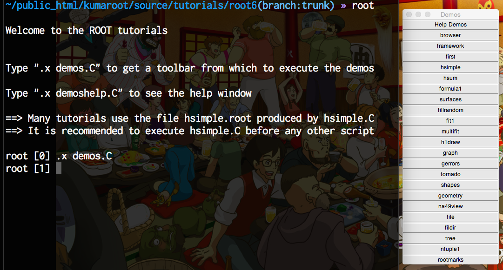

==================================================
デモの実行（ :command:`.x demos.C` ）
==================================================

.. code-block:: bash

    $ root demos.C

前ページの起動時のメッセージにしたがって、チュートリアル付属のデモを実行してみます。
CINTで実行する場合は :command:`.x demos.C` と入力します。
シェルから実行する場合は :command:`root demos.C` のようにファイルを引数に指定します。
どちらの場合もファイル名の部分は ``TAB補完`` ができます。

すると :numref:`fig-root-demos` の右端のように ``Demos ツールバー`` が出てきます。

.. _fig-root-demos:

   CINT内で :command:`.x demos.C` を実行した時の画面

この ``Demos ツールバー`` の一番上の ``Help Demos`` ボタンをクリックすると :numref:`fig-root-helpdemos` のようなキャンバスが表示されます。

.. _fig-root-helpdemos:
.. figure:: ./root-tutorial/root-helpdemos.png
   :align: center

   ``Help Demos`` をクリックすると出てくるキャンバス

一番最初に

  Run demo hsimple.C first.

とあるので、これに従います。

``Demos ツールバー`` の上から５番目の ``hsimple`` ボタンをクリックするか、CINTに :command:`.x hsimple.C` と入力します。
シェルに :command:`root hsimple.C` と入力してもOKです。
