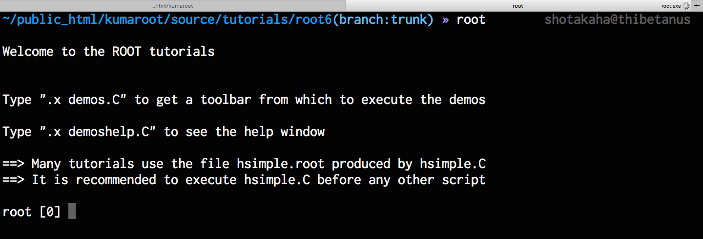

==================================================
ROOTの起動（ :command:`$ root` ）
==================================================

.. code-block:: bash

   $ root
   ...
   root [0]

コマンドラインで :command:`root` と入力します。
するとROOTセッション（CINT）が起動し、左端が ``root [番号]`` になります。
この状態だと対話的にROOTを操作することができます。

:file:`$TUTORIALS` でROOTを起動すると :numref:`fig-root-start` のようになり、なにやらメッセージが表示されています。
これは同じディレクトリに :file:`rootlogon.C` というファイルがあるためです。
:file:`rootlogon.C` には、このように起動時に表示したいメッセージや、実行したいスクリプト、後述するROOTの全体設定などを書いておくことができます。

僕の場合、数ヶ月ぶりに触るプログラムなんてほとんど忘れてしまっています。
なので :file:`rootlogon.C` に手順を書いて残したりしています。

.. _fig-root-start:

   チュートリアルのディレクトリでROOTを起動したときの画面表示
