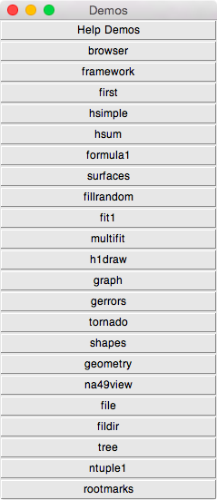
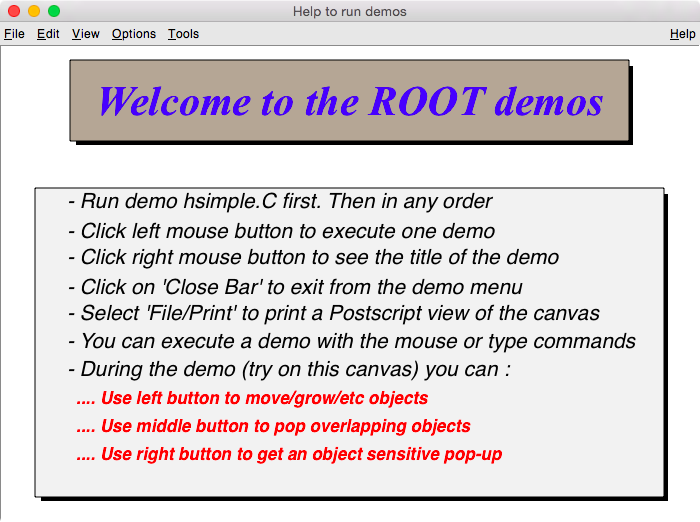
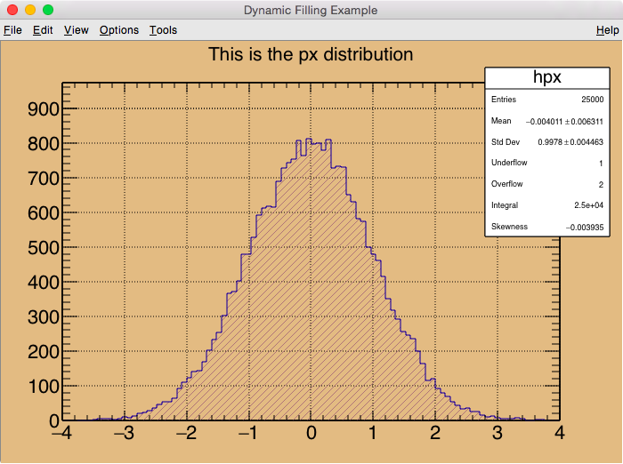

==================================================
ROOT tutorial 編
==================================================

この章では、主にROOTに付属しているチュートリアルの使い方を簡単に紹介します。
前節の最後にも書きましたが、手元にコピーを作っておきましょう。

.. code-block:: bash

    $ cp -r /opt/local/libexec/root6/share/doc/root/tutorials ~/TEST/root6/

とりあえずROOT6のチュートリアルを使います。
気が向いたらROOT5との比較もしようかと思います。

とりあえず起動（ ``$ root`` ）
--------------------------------------------------

.. code-block:: bash

    $ cd ~/TEST/root6/tutorials/
    $ root

    root[0]    ## ROOTセッション（CINT）内

コマンドラインで ``root`` と入力するとROOTセッション（CINT）が起動します。
この状態だと、対話的にROOTを操作することができます。

とりあえず終了（ ``.q`` ）
--------------------------------------------------

.. code-block:: bash

    root [0] .q

ROOTセッション内で ``.q`` を入力すると、ROOTが終了します。
それで終了しない場合は、``.qqq・・・`` の様に ``q`` をたくさんにします。

``rootlogon.C`` と ``rootlogoff.C``
--------------------------------------------------

さて ``tutorials`` をコピーしたディレクトリでROOTを起動／終了すると、
以下の様なメッセージが表示されるとはずです。

.. code-block:: bash

    Welcome to the ROOT tutorials

    Type ".x demos.C" to get a toolbar from which to execute the demos

    Type ".x demoshelp.C" to see the help window

    ==> Many tutorials use the file hsimple.root produced by hsimple.C
    ==> It is recommended to execute hsimple.C before any other script

    root [0]

.. code-block:: bash

    Taking a break from ROOT? Hope to see you back!

これは、同じディレクトリに、 ``rooglogon.C`` と ``rootlogoff.C`` があるからです。
この２つのファイルを用意しておくことで、ROOT起動時および終了時の動作を設定することができます。
気になる人は覗いてみましょう（ ``printf`` してるだけですが）。

僕の場合、数ヶ月ぶりに触るプログラムなんてほとんど忘れてしまっています。
なので ``rootlogon.C`` に手順を書いて残したりしています。

ROOT起動時に読み込まれるファイルの順番
--------------------------------------------------

ROOT起動時には以下の順番で設定ファイルが読み込まれます。

#. ``system.rootrc``
#. ``~/.rootrc``
#. ``./rootlogon.C``

個人的な全体設定は ``~/.rootrc`` へ、
そのプログラムだけの設定は ``./rootlogon.C`` に書いておけばよいです。

demos.Cを実行してみる
--------------------------------------------------

さて、ROOTを起動して表示されたメッセージにしたがって、 ``demos.C`` を実行してみましょう。
ROOT内で実行する場合は、 ``.x ファイル名`` と入力します。
ファイル名の部分は ``TAB補完`` ができます。
これをbashで実行する場合は以下のようにします。

.. code-block:: bash

    $ root demos.C

さてさて、実行すると :numref:`fig-demosC` のようなツールバーが出てきます。

.. _fig-demosC:

   ``demos.C`` を実行した時に出てくるツールバー的なもの

一番上にある ``Help Demos`` をクリックすると、
:numref:`fig-helpdemos` のようなキャンバスが表示されます。

.. _fig-helpdemos:

   Help Demos を実行すると出てくるキャンバス

とりあえずこの通りに ``hsimple`` ボタンを押してみましょう。

hsimple.Cを実行する
--------------------------------------------------

前節のようにボタンを押して実行するか、
コマンドラインで ``$ root hsimple.C`` を実行します。
すると、キャンバスが表示され、ヒストグラムが成長していきます（ :numref:`fig-hsimple` ）。
それと同時に、 ``hsimple.root`` というROOTファイルが作成されます。

.. _fig-hsimple:

   ``hsimple`` を実行した時に表示されるキャンバス

それでは ``hsimple.C`` を開いて、
上から順番に何をしているのかを確認してみましょう。

インクルードファイル（ ``#include`` ）
--------------------------------------------------

``#include`` で始まるのはインクルードファイルです。
コンパイルする場合は必須ですが、マクロで動かす場合は書かなくてもよいです。
なので今は無視します。

.. literalinclude:: ../root6/tutorials/hsimple.C
   :language: cpp
   :lines: 1-11
   :lineno-start: 1

関数の定義
--------------------------------------------------

マクロの場合ファイル名と関数名は一緒にします。
戻り型はなんでもOKです。引数を指定することもできます。

.. literalinclude:: ../root6/tutorials/hsimple.C
   :language: cpp
   :lines: 13
   :lineno-start: 13

コメントの挿入（ ``//`` ）
--------------------------------------------------

コメントはC++の作法で挿入できます。

.. literalinclude:: ../root6/tutorials/hsimple.C
   :language: cpp
   :lines: 14-25
   :lineno-start: 14

ファイル名の宣言（ ``TString`` ）
--------------------------------------------------

TStringクラスという文字列クラスを使っています。
普通のC/C++の関数を使うよりはるかに楽なので、積極的に使うと良いと思います。

.. literalinclude:: ../root6/tutorials/hsimple.C
   :language: cpp
   :lines: 27-51
   :lineno-start: 27

ROOTファイルを開く（ ``TFile`` ）
--------------------------------------------------

``TFile`` クラスを使います。
直前の ``if`` 文の中ではファイルの存在を確認しています。
ファイルがある場合は、 ``TFile::Open`` メソッドでファイルを開いています。
ない場合は、 ``TFile::TFile`` コンストラクタで
新しい ``TFileオブジェクト`` を作成しています。

.. literalinclude:: ../root6/tutorials/hsimple.C
   :language: cpp
   :lines: 31,37,42,52-53

ヒストグラムを作成する
--------------------------------------------------

``TH1`` クラス、 ``TH2`` クラスなどを使います。
ここでは ``TProfile`` クラスや ``TNtuple`` クラスも使われています。

.. literalinclude:: ../root6/tutorials/hsimple.C
   :language: cpp
   :lines: 55-60
   :lineno-start: 55

プロセス時間の測定開始・表示（ ``gBenchmark`` ）
--------------------------------------------------

このマクロを実行すると、ターミナル上にプロセス時間が表示されます。
この部分から測定を開始しています。

.. literalinclude:: ../root6/tutorials/hsimple.C
   :language: cpp
   :lines: 62,92

キャンバスの作成（ ``TCanvas`` ）
--------------------------------------------------

グラフを描く領域をキャンバスと呼びます。
``TCanvas`` クラスを使います。

.. literalinclude:: ../root6/tutorials/hsimple.C
   :language: cpp
   :lines: 64-69
   :lineno-start: 64

ヒストグラムに値を詰める（ ``Fill`` ）
--------------------------------------------------

このマクロでは、ヒストグラムにランダムな値を詰め込んでいます。

.. literalinclude:: ../root6/tutorials/hsimple.C
   :language: cpp
   :lines: 72-83
   :lineno-start: 72

キャンバスに描画する（ ``Draw`` ）
--------------------------------------------------

TH1::Draw()メソッドで描画します。

.. literalinclude:: ../root6/tutorials/hsimple.C
   :language: cpp
   :lines: 84-91
   :lineno-start: 84

ROOTファイルに保存する（ ``Write`` ）
--------------------------------------------------

.. literalinclude:: ../root6/tutorials/hsimple.C
   :language: cpp
   :lines: 94-103
   :lineno-start: 94
